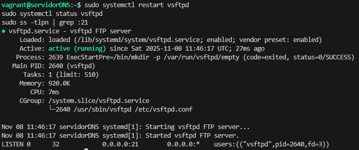
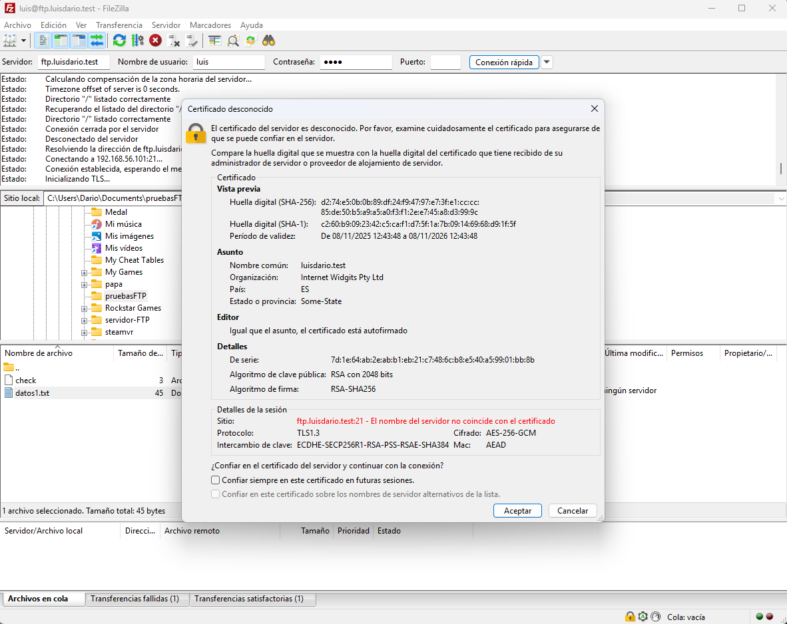
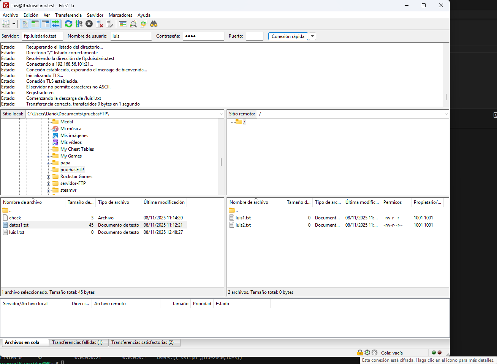
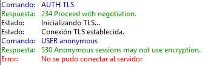

# Práctica FTP: Configuración de un servidor FTP

## Sumario:

1. Configuraciones previas
2. Usando un cliente GUI de FTP
3. Instalación de vsftpd
4. Configuración del servidor vsftpd seguro

## 1. Configuraciones previas

Vamos a empezar clonando nuestro anterior proyecto dns-paso-a-paso para tener una base. Hecho esto ya tendríamos un servidor DNS listo para funcionar.


Vamos ahora a configurar el servidor. Ahora tendremos que cambiar las direcciones IP y algunos ajustes de las zonas. Todos los cambios están en la carpeta [config](https://github.com/dariob2190/servidor-FTP/tree/main/config).

Como ya hemos visto en la práctica anterior cómo se configura un servidor DNS paso a paso no voy a profundizar.

Lo que sí vamos a hacer es comprobar que todo funcione correctamente con `dig` y `nslookup`:

Primero con `dig` usamos el comando `dig @192.168.56.101 debian.luisdario.test`, y nos tendría que salir algo así:


Ahora con `nslookup` usamos el comando `nslookup debian.luisdario.test 192.168.56.101`, y nos tendría que salir algo así:


## 2. Usando un cliente GUI

Vamos a instalar y hacer una breve introducción a un cliente FTP con GUI (Graphical User Interface). En mi caso voy a utiliar FileZilla que es uno de los más usados actualmente, pero se puede escoger cualquier otro.

El primer paso sería instalar FileZilla desde su [página oficial](https://filezilla-project.org/). Una vez instalado al ejecutarlo nos encontramos una interfaz como la siguiente:


Vamos ahora a crear un directorio y entramos en él. Lo vamos a llamar `pruebasFTP`.


Vamos a crear un fichero de prueba con el contenido que queramos.


Continuemos conectandonos a `ftp.cica.es` de forma anónima. Para ello ponemos la ruta en el campo Servidor dentro de FileZilla y hacemos clic en 'Conexión rápida'. Vamos ahora dentro de la carpeta `pub` y ahí encontraremos un fichero llamado `check`. Lo descargamos haciendo clic derecho y 'Descargar'.


Ahora en nuestra carpeta podemos ver que se ha descargado correctamente.


Vamos ahora a tratar de subir el archivo que creamos anteriormente, para ello hacemos clic derecho y pinchamos en 'Subir'. Sin embargo podemos ver que el servidor nos responde con permiso denegado debído a las políticas establecidas en el servidor.


Para desconectarnos hacemos clic en la barra de arriba donde hay un icono de un ordenador y una cruz roja.


## 3. Instalación de vsftpd

Vamos a instalar el servicio de FTP en nuestra máquina virtual con vsftpd, para ello ejecutamos el comando `sudo apt install vsftpd`. Comprobemos si se ha creado el usuario `ftp` y si su directorio `home` es `/srv/ftp/`, para ello usamos el comando `cat /etc/passwd` y bucamos por el final de nuestro fichero el usuario:


También podemos comprobar los grupos y buscar que nuestro usuario pertenezca al grupo `ftp` con el comando `cat /etc/group`:


Comprobemos también que se haya creado correctamente la carpeta `/srv/ftp`, que su propietario sea `root` y su grupo sea `ftp`:


Vamos a listar ahora los usuarios que no pueden acceder al servicio FTP con el comando `cat /etc/ftpusers`:


Comprobemos ahora el estado del servidor con `sudo systemctl status vsftpd`


Comprobemos ahora si el puerto 21 (que corresponde con el servidor FTP) está escuchando. Para ello podemos usar `ss -tlpn` en mi caso he usado `grep` para filtrar entre todos los resultados:


Vamos a hacer una copia de seguridad de la configuración del servidor por si acaso estropeamos la configuración, para ello usamos el comando `sudo mv /etc/vsftpd.conf /etc/vsftpd.conf.bak`. En mi caso he usado `mv` para sólo cambiarle el nombre, ya que voy a hacer el fichero de configuración desde 0.

Ahora vamos a crear 3 usuarios locales para poder hacer más pruebas. para crear los usuarios usaremos `sudo useradd -m <usuario>` (el `-m` es necesario, ya que esto nos creará la carpeta `/home` del usuario que necesitaremos para hacer pruebas más adelante), y cambiaremos la contraseña con `sudo passwd <usuario>` con usar de contraseña el nombre de usuario nos servirá:


Vamos a crear ahora unos ficheros de prueba:

```
sudo touch /home/luis/luis{1,2}.txt
sudo chown luis:luis /home/luis/luis*.txt
sudo touch /home/maria/maria{1,2}.txt
sudo chown maria:maria /home/maria/maria*.txt
```

Ahora ya vamos a modificar la configuración del servidor, para ello ejecutamos `sudo nano /etc/vsftpd.conf` y lo rellenamos según necesitamos. En mi caso, este es mi fichero de configuración:

```
# No se muestran valores predeterminados que encajan con las necesidades

# Modo standalone en IPv4
listen=YES

# Mensaje de bienvenida
ftpd_banner=--- Welcome to the FTP server of 'luisdario.test' ---

# Para usuarios anónimos hay que ponerlo en un fichero a parte
dirmessage_enable=YES
message_file=/srv/ftp/ftpwelcome

# Cerra conexiones inactivas por 720s
idle_session_timeout=720

# Límite de ancho de banda
local_max_rate=5000000
anon_max_rate=2000000

# Permisos para usuarios anónimos
anonymous_enable=YES

# Permisos para usuarios locales
local_enable=YES
write_enable=YES

# Los usuarios locales quedaran "enjaulados" en su home
chroot_local_user=YES
allow_writeable_chroot=YES
# El comando allow_writeable_chroot=YES permite que los usuarios puedan tener su /home con permisos de escritura.
# Esto por defecto esta desactivado como medida de seguridad para que los usuarios no se escapen.

# Excepción de enjaulamiento
chroot_list_enable=YES
chroot_list_file=/etc/vsftpd.chroot_list
```

Antes de seguir tenemos que configurar externamente el banner para los usuarios anónimos y las excepciones del enjaulamiento de usuarios locales.

Para el banner usamos el comando `sudo nano /srv/ftp/ftpwelcome` y dentro ponemos el mensaje que queramos, en mi caso he puesto `---You have accessed the public directory server of 'luisdario.test'---`

Para las excepciones de enjaulamiento usamos el comando `sudo nano /etc/vsftpd.chroot_list` y dentro ponemos las excepciones, en mi caso solo pondré `maria`.

Una vez hecho esto reiniciamos el servicio y comprobamos que todo funciona, lo podemos hacer con el siguiente comando:

```
sudo systemctl restart vsftpd
sudo systemctl status vsftpd
sudo ss -tlpn | grep :21
```

Tendría que aparecer algo así:


Ahora vamos a comprobar que pasa si nos conectamos desde un usuario anónimo a nuestro servidor:


Podemos ver que nos conectamos de forma satisfactoría, lo único que FileZilla oculta los comandos que se ejecutan con éxito y las respuestas del servidor, por lo que al conectarnos con éxito, FileZilla oculta el mensaje del servidor de bienvenida que se envía como respuesta al comando.


Ahora vamos a conectarnos como `maria` para comprobar que **no** estamos enjaulados en su `home`:


Podemos ver que podemos salir de nuestro `home` y ver todo el árbol de directorios.


Ahora vamos a conectarnos como `luis` para comprobar que **si** estamos enjaulados en su `home`:


Como podemos ver, con `luis` no podemos salir de su `home` a diferencia de con `maria`.


## 4. Configuración del servidor vsftpd seguro

Vamos a empezar creando archivos donde guardar nuestro certificado, para ello usaremos el comando `sudo mkdir -p /etc/ssl/certs`, y ahora generamos el certificado autofirmado para nuestro dominio con el siguiente comando:
```
sudo openssl req -x509 -nodes -days 365 -newkey rsa:2048 \
 -keyout /etc/ssl/certs/luisdario.test.key \
 -out /etc/ssl/certs/luisdario.test.pem
```

Ahora vamos a configurar nuestro servidor para que use el certificado y otros ajustes varios como por ejemplo que los usuario anónimos no se puedan conectar con el certificado. La segunda parte de mi archivo de configuarción quedaría algo así
```
# ^ ARRIBA TIENE QUE ESTAR EL RESTO DEL CÓDIGO ^
# PEGAR ESTO DEBAJO

# FTPS
ssl_enable=YES

# Ruta del certificado y clave
# Ruta del certificado y clave
# Ruta del certificado y clave
rsa_cert_file=/etc/ssl/certs/luisdario.test.pem
rsa_private_key_file=/etc/ssl/certs/luisdario.test.key

# Requerir SSL para usuarios locales
force_local_data_ssl=YES
# Ruta del certificado y clave
rsa_cert_file=/etc/ssl/certs/luisdario.test.pem
rsa_private_key_file=/etc/ssl/certs/luisdario.test.key

# Requerir SSL para usuarios locales
force_local_data_ssl=YES
# Ruta del certificado y clave
rsa_cert_file=/etc/ssl/certs/luisdario.test.pem
rsa_private_key_file=/etc/ssl/certs/luisdario.test.key

# Requerir SSL para usuarios locales
# Ruta del certificado y clave
rsa_cert_file=/etc/ssl/certs/luisdario.test.pem
rsa_private_key_file=/etc/ssl/certs/luisdario.test.key
# Ruta del certificado y clave
rsa_cert_file=/etc/ssl/certs/luisdario.test.pem
# Ruta del certificado y clave
rsa_cert_file=/etc/ssl/certs/luisdario.test.pem
# Ruta del certificado y clave
# Ruta del certificado y clave
rsa_cert_file=/etc/ssl/certs/luisdario.test.pem
rsa_private_key_file=/etc/ssl/certs/luisdario.test.key

# Requerir SSL para usuarios locales
force_local_data_ssl=YES
force_local_logins_ssl=YES

# No permitir SSL en anónimo
allow_anon_ssl=NO

# Evitar problemas con algunos clientes FTPS
require_ssl_reuse=NO
```

Ahora tan solo reiniciamos y comprobamos:
```
sudo systemctl restart vsftpd
sudo systemctl status vsftpd
sudo ss -tlpn | grep :21
```

Y tendría que devolvernos algo tal que así:


Vamos a comprobar ahora que el servidor funciona completamente usando además FTPS. Vamos a emepzar probando con `luis`



Podemos ver que nos sale una gran ventana preguntandonos si queremos seguir conectandonos y confiar en el certificado, al hacerle clic en sí, ya estaremos conectados a nuestro mediante FTPS. Si probamos a descargar un fichero nos aparecerá un icono mientras descargamos estos ficheros indicando la seguridad de la conexión, además abajo de la ventana podemos ver un candado que indica que la conexión es segura.



Sin embargo al intentar conectarnos como anónimo, por nuestra configuración, nuestro servidor rechazará la conexión. Tendríamos que conectarnos sin usar ese certificado que aceptamos cuando nos conectamos como `luis`



Por último voy a conectarme como `maria` y FTPS:

