# Práctica DNS: Configuración de un servidor

## Sumario:

1. Configuraciones previas
2. Instalación del servidor
3. Configuración del servidor
4. Comprobaciones de las configuraciones
5. Comprobación usando _dig_
6. Comprobación usando _nslookup_
7. Cuestiones finales


## 1. Configuraciones previas

Vamos a empezar creando un directorio en Github.
Nos vamos a nuestro perfil de Github y pinchamos en "Repositories" o "Repositorios".

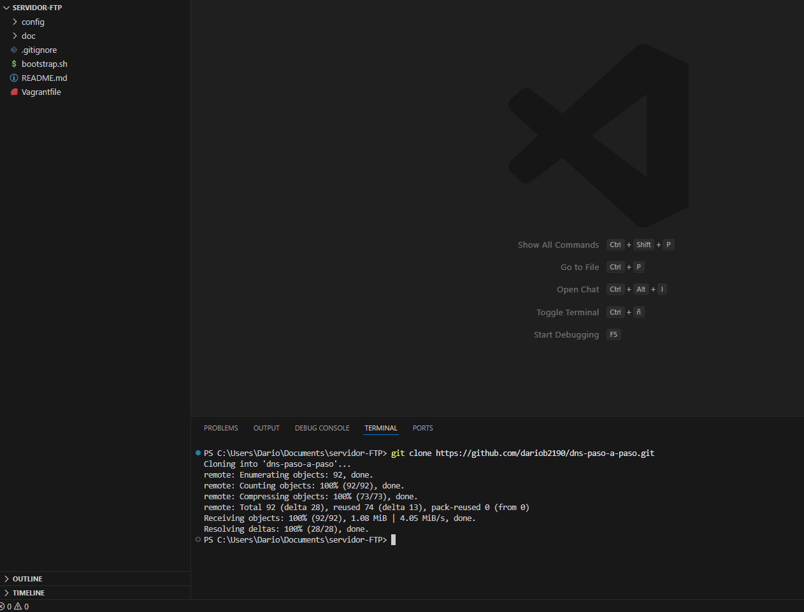


Una vez ahí hacemos clic en "New" o "Nuevo" para crear un nuevo repositorio.

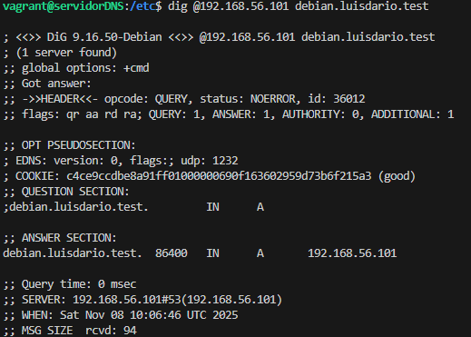


Una vez aquí establecemos las preferencias de nuestro repositorio, en mi caso serán poner el nombre apropiado, hacerlo privado y crearé el README.md.

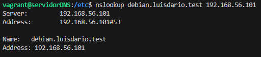


Vamos a pasar ya a Visual Studio Code. Vamos a hacer un `git clone` (necesitamos tener Git previamente instalado y configurado) de nuestro repositorio (en mi caso será `git clone git@github.com:dariob2190/dns-paso-a-paso.git`) para poder tener una copia del repositorio en la carpeta donde ejecutemos el comando (en mi caso, Documentos).

Una vez lo hayamos copiado, abrimos la carpeta. Vamos a editar el README.md y lo subimos al repositorio.

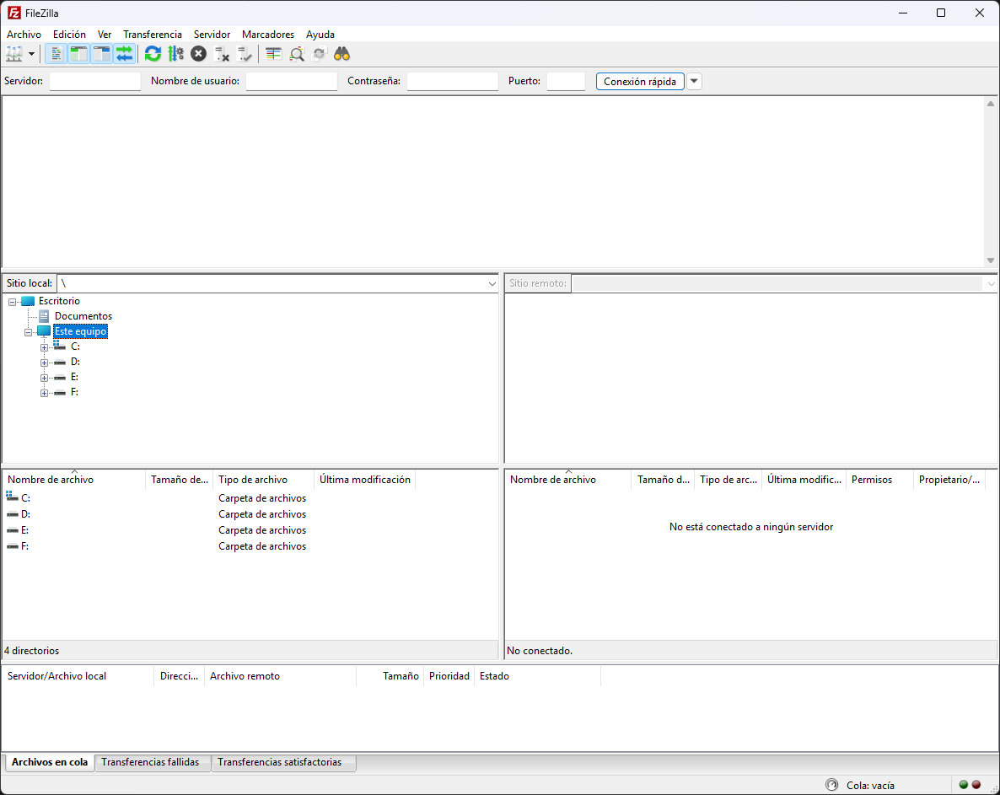


A continuación vamos a crear y editar el .gitignore y lo subimos también.

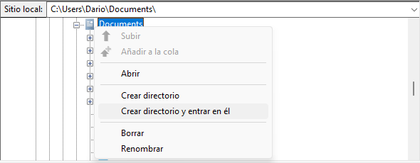


Vamos a crear el fichero Vagrantfile, para ello ejecutamos `vagrant init debian/bullseye64` (debemos instalar previamente vagrant) y esperamos a que nos cree el fichero.

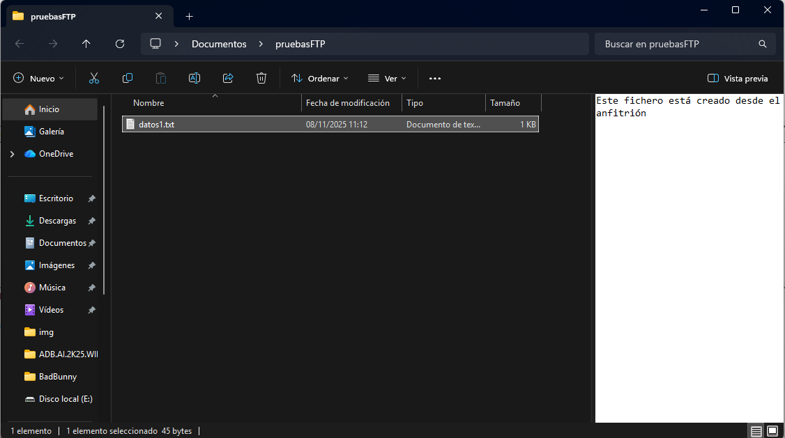


Vamos a crear el fichero boostrap.sh. No lo completaremos ahora pero ya lo tendremos listo.


Ahora nos vamos a los hosts de nuestro equipo cliente y nos aseguramos que no tengamos nada adicional.

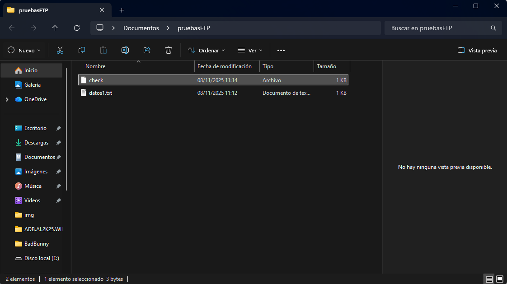


## 2. Instalación del servidor

Comencemos a instalar todo lo necesario.
Para empezar vamos a conectarnos a la máquina de Vagrant con el comando `Vagrant ssh`.

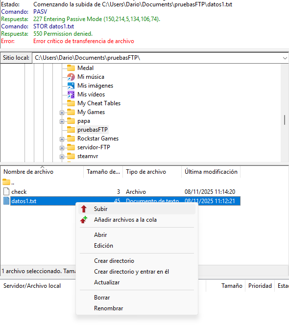


Vamos a instalar Bind. Para ello vamos a ejecutar un `sudo apt install bind9 bind9utils bind9-doc` para instalarlo (puede ser necesario ejecutar `sudo apt update`).


## 3. Configuración del servidor

Ahora vamos a editar `/etc/default/named`. Yo usaré `nano` que es el editor que más me gusta pero se puede utilizar cualquier otro.
Para editar el fichero primero necesitamos usar `sudo`para poder modificarlo. Ejecutariamos el comando tal que así `sudo nano /etc/default/named`.
Una vez dentro en la línea `OPTIONS=...` tenemos que añadir "-4" al final, quedando tal que así:

```
OPTIONS="-u bind -4"
```

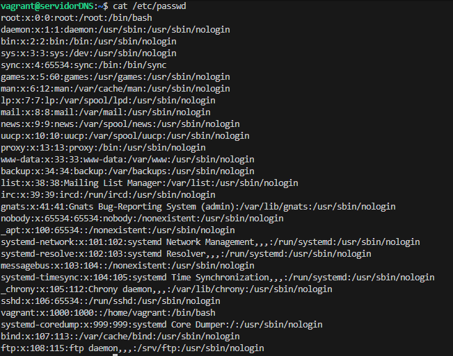


Vamos ahora a editar el fichero `/etc/bind/named.conf.options`, pero al ser un fichero tan sensible es mejor que hagamos una copia de seguridad. Podemos hacerlo con el comando `sudo cp /etc/bind/named.conf.options /etc/bind/named.conf.backup`.

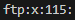


Vamos a entrar ahora en `/etc/bind/named.conf.options` y tenemos que dejarlo tal que así:

```
acl confiables {
        192.168.1.0/24;
};

options {
        directory "/var/cache/bind";

        // If there is a firewall between you and nameservers you want
        // to talk to, you may need to fix the firewall to allow multiple
        // ports to talk.  See http://www.kb.cert.org/vuls/id/800113

        // If your ISP provided one or more IP addresses for stable
        // nameservers, you probably want to use them as forwarders.
        // Uncomment the following block, and insert the addresses replacing
        // the all-0's placeholder.

        // forwarders {
        //      0.0.0.0;
        // };

        allow-transfer { none; };

        listen-on port 53 { 192.168.2.45; };

        recursion yes;
        allow-recursion { confiables; };

        //========================================================================
        // If BIND logs error messages about the root key being expired,
        // you will need to update your keys.  See https://www.isc.org/bind-keys
        //========================================================================
        dnssec-validation yes;

        // listen-on-v6 { any; };
};
```

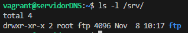


Gracias al comando `named-checkconf` podemos comprobar si hay algún error sintáctico. Ejecutamos el comando `sudo named-checkconf /etc/bind/named.conf.options`. Si nos devuelve algo será un error, si no, significa que todo está correcto.

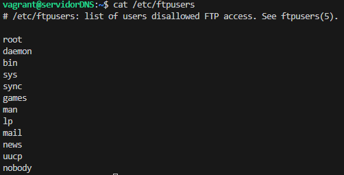


Vamos a reiniciar el servicio de `named` con `sudo systemctl restart named` y comprobamos el estado con `systemctl status named`.

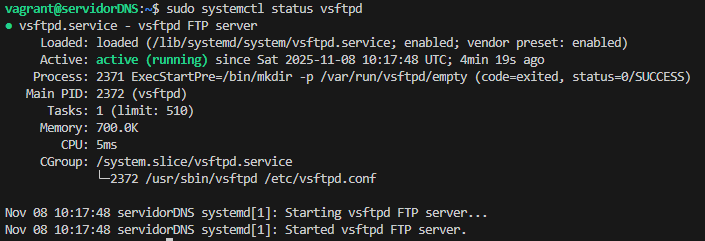


Vamos a añadir al fichero `named.conf.local` las zonas, la normal y la inversa. Tiene que quedar algo tal que así:

```
zone "luisdario.test" {
    type master;
    file "/var/lib/bind/luisdario.test.dns";
};

zone "2.168.192.in-addr.arpa" {
    type master;
    file "/var/lib/bind/luisdario.test.rev";
};
```

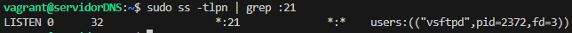


Ahora vamos a crear los ficheros mencionados en `/etc/bind/named.conf.local`, `/var/lib/bind/luisdario.test.dns` y `/var/lib/bind/luisdario.test.rev`. Empecemos con `/var/lib/bind/luisdario.test.dns`. Ejecutamos `sudo nano /var/lib/bind/luisdario.test.dns` y lo dejaremos tal que así:

```
;
; luisdario.test
;
$TTL    86400
@       IN      SOA     debian.luisdario.test.  admin.luisdario.test.   (
    202510131       ; Serial
    3600    ; Refresh
    1800    ; Retry
    604800  ; Expire
    86400 ) ; Negative Cache TTL

@       IN      NS      debian.luisdario.test.
debian.luisdario.test.  IN      A       192.168.2.45
cliente.luisdario.test. IN      A       192.168.1.45
```

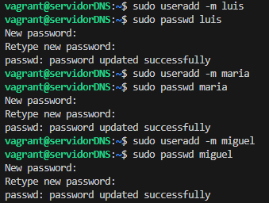


Ahora vamos con `/var/lib/bind/luisdario.test.rev`. Ejecutamos `sudo nano /var/lib/bind/luisdario.test.rev` y lo dejamos tal que así:

```
;
; Zona inversa para 192.168.2.X
;
$TTL 86400
@       IN      SOA     debian.luisdario.test.  admin.luisdario.test.   (
    202510131       ; Serial
    3600    ; Refresh
    1800    ; Retry
    604800  ; Expire
    86400 ) ; Negative Cache TTL

@       IN      NS      debian.luisdario.test.
45      IN      PTR     debian.luisdario.test.
```

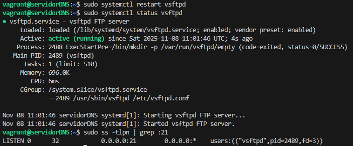


## 4. Comprobaciones de las configuraciones

Vamos a comprobar que todos los ficheros esten bien configurados. Usamos `sudo named-checkzone luisdario.test /var/lib/bind/luisdario.test.dns` y `sudo named-checkzone 2.168.192.in-addr.arpa /var/lib/bind/luisdario.test.rev`.

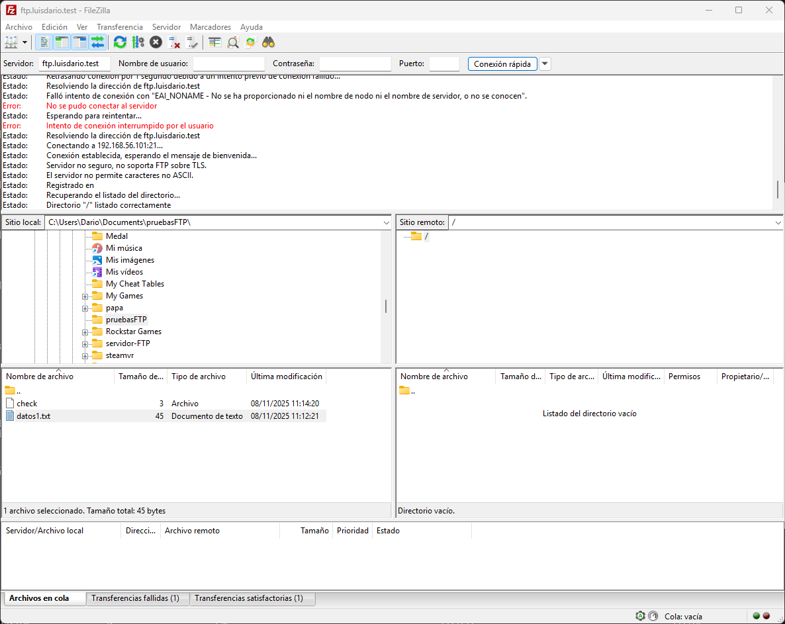

Ahora solo hacemos un `sudo systemctl restart bind` y nuestro servidor estaría listo.


## 5. Comprobación usando _dig_

Vamos a usar `dig` ahora para comprobar que todo funciona como debería con `dig @192.168.2.45 debian.luisdario.test`.

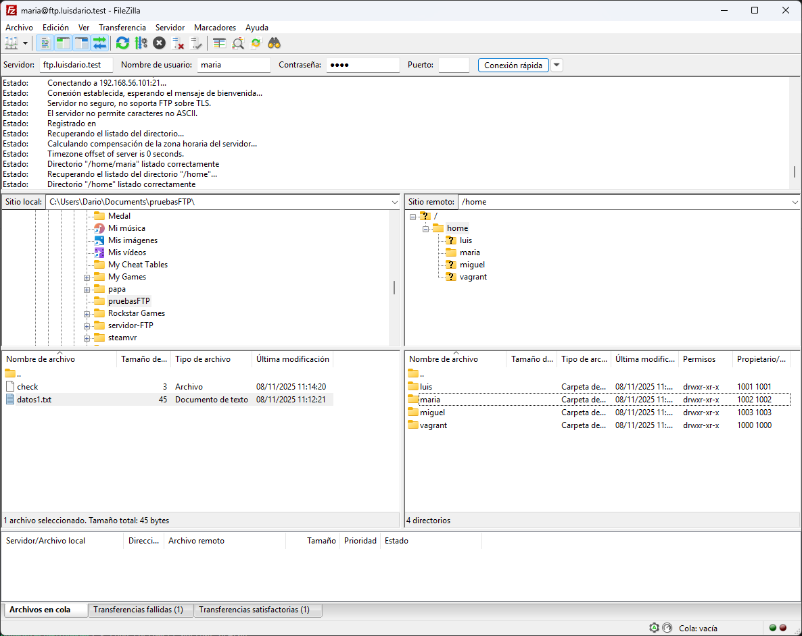


## 6. Comprobación usando _nslookup_

Vamos a usar `nslookup` ahora para comprobar que todo funciona como debería con `nslookup debian.luisdario.test 192.168.1.45`.

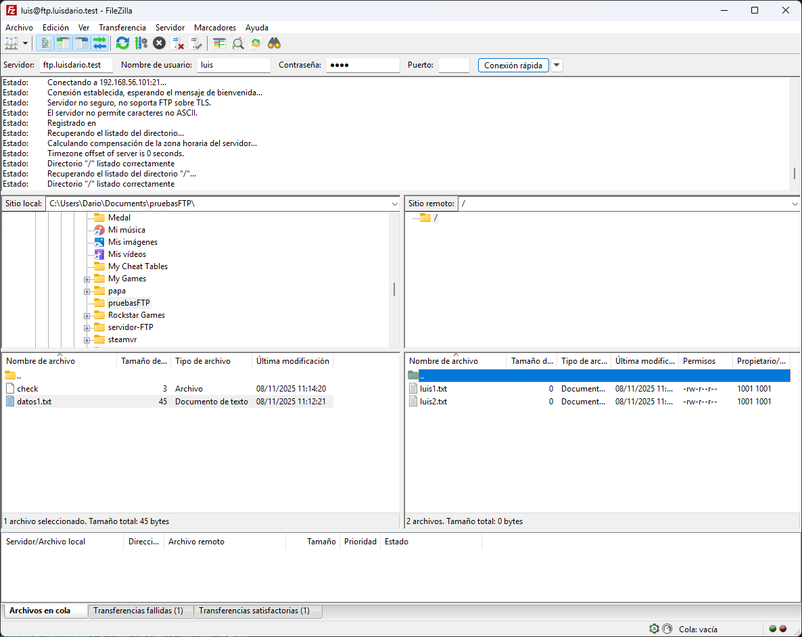


## 7. Cuestiones finales

1. ¿Qué pasará si un cliente de una red diferente a la tuya intenta hacer uso de tu DNS?

No le funcionará, porque en el fichero `/etc/bind/named.conf.options` definimos un ACL llamado confiables con la red `192.168.1.0/24` y luego permitimos recursión solo a esas direcciones. Esto significa que solo clientes dentro de esa red pueden realizar consultas recursivas. Otros clientes serán rechazados.


2. ¿Por qué tenemos que permitir las consultas recursivas en la configuración?

Porque permiten que el servidor busque por los clientes cualquier dominio que no esté en sus zonas locales.


3. El servidor DNS que acabáis de montar, ¿es autoritativo? ¿Por qué?

Sí, es autoritativo para las zonas que hemos configurado (`luisdario.test` y `2.168.192.in-addr.arpa`). En `named.conf.local` definimos las zonas como `type master` y proporcionamos los ficheros de zona. Esto indica que nuestro servidor tiene la autoridad para responder sobre esos dominios específicos.


4. ¿Dónde podemos encontrar la directiva $ORIGIN y para qué sirve?

`$ORIGIN` se puede incluir al inicio de un fichero de zona DNS para definir el dominio base para los registros siguientes.


5. ¿Una zona es idéntico a un dominio?

No, un dominio puede abarcar varias zonas.


6. ¿Cuántos servidores raíz existen?

Existen 13 servidores raíz de DNS a nivel mundial, organizados en grupos con letras de la A a la M.


7. ¿Qué es una consulta iterativa de referencia?

Es cuando un servidor DNS no sabe la respuesta final y en lugar de resolverla por completo, devuelve al cliente la dirección de otro servidor DNS más cercano al objetivo.


8. En una resolución inversa, ¿a qué nombre se mapearía la dirección IP 172.16.34.56?

`56.34.16.172.in-addr.arpa`.